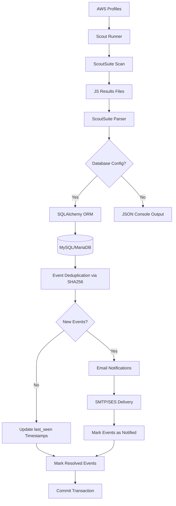
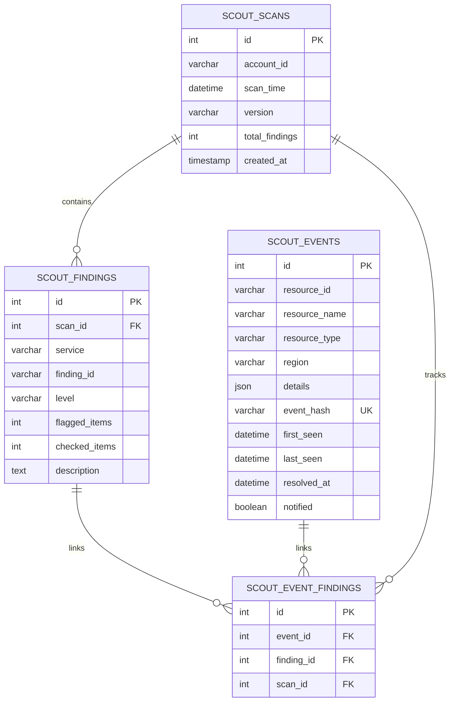
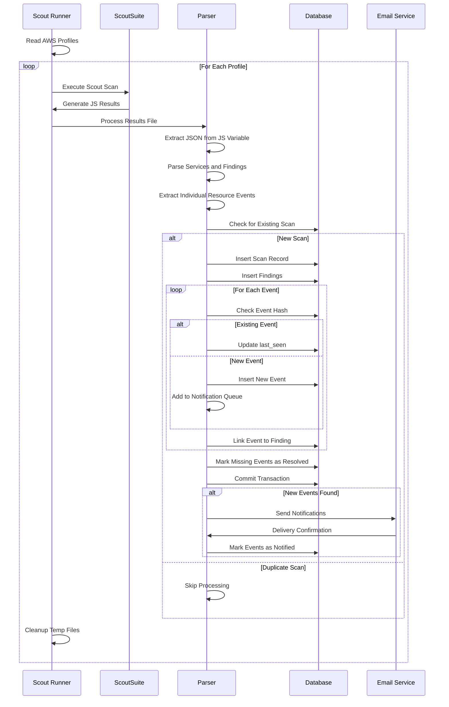
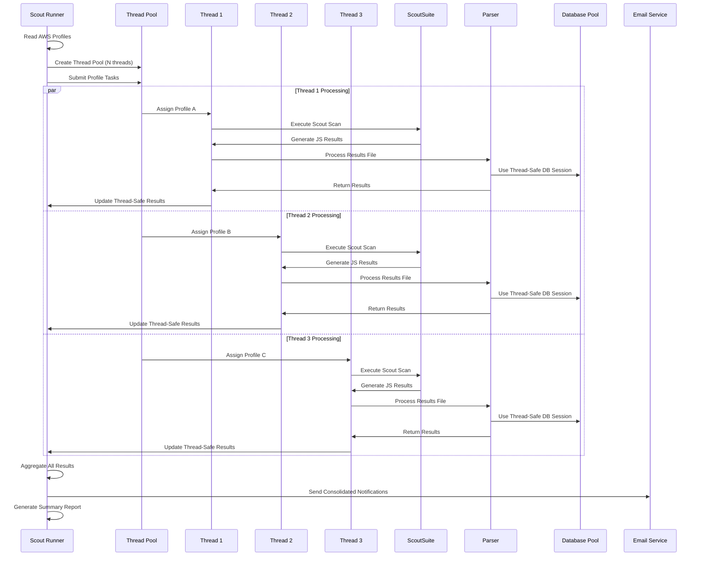
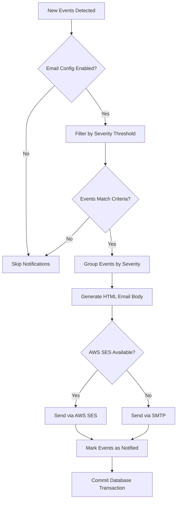
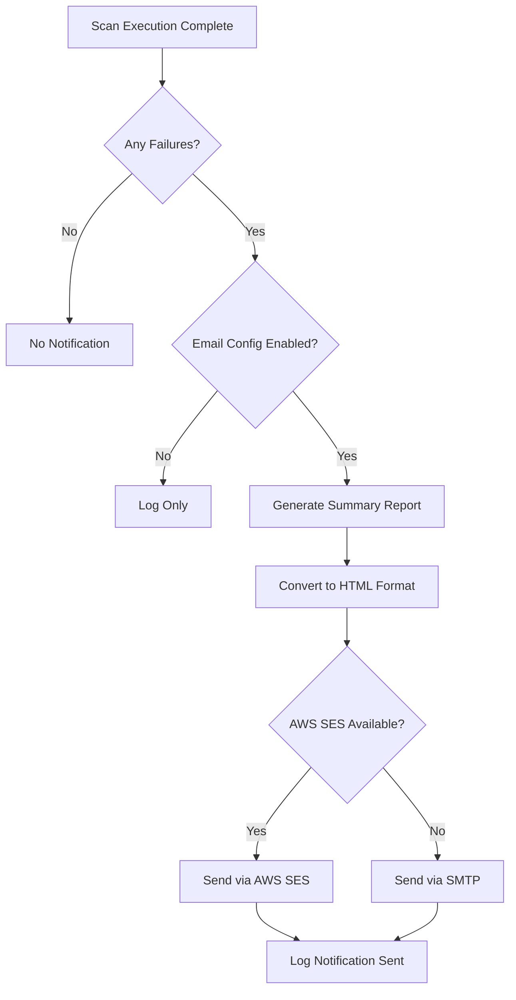

# ScoutSuite Parser

A comprehensive parser for NCC Group's open-source ScoutSuite security auditing tool, designed to extract individual resource-level security events from ScoutSuite JavaScript results files and store them in a MySQL/MariaDB database with intelligent deduplication and email notification capabilities.

## TL;DR - Quick Start

```bash
# 1. Setup (first time only)
python3 scout_runner.py --setup
cp .env.example .env  # Edit with your DB credentials

# 2. Scan all AWS accounts
python3 scout_runner.py

# 3. Scan specific account
python3 scout_runner.py --account production
```

## Usage

### Automated Scanning with Scout Runner
```bash
# Setup ScoutSuite environment (first time only)
python3 scout_runner.py --setup

# Scan all AWS profiles in ~/.aws/config
python3 scout_runner.py

# Scan specific AWS profile
python3 scout_runner.py --account my-profile

# Debug mode
python3 scout_runner.py --debug
```

### Manual Parser Operation
```bash
# Console output (no database)
python3 scoutsuite_parser.py results.js

# Database storage with .env configuration
python3 scoutsuite_parser.py results.js

# Debug mode with detailed logging
python3 scoutsuite_parser.py results.js --debug
```

### Scout Runner Command Line Arguments
```bash
# Setup ScoutSuite environment
python3 scout_runner.py --setup

# Scan all AWS profiles (single threaded)
python3 scout_runner.py

# Scan all AWS profiles with 3 concurrent threads
python3 scout_runner.py --multithread 3

# Scan specific profile by name
python3 scout_runner.py --account production

# Scan by AWS account ID (searches profiles containing this ID)
python3 scout_runner.py --account 123456789012

# Debug mode with detailed logging
python3 scout_runner.py --debug

# Combine options - multithreaded with debug
python3 scout_runner.py --multithread 2 --debug

# Health check virtual environment
python3 scout_runner.py --healthcheck
```

### Manual Parser Command Line Arguments
```bash
# Override database settings
python3 scoutsuite_parser.py results.js \
  --db-host production-db.company.com \
  --db-user prod_user \
  --db-password secure_password \
  --db-name scoutsuite_db \
  --debug
```

## Architecture Overview



## Core Features

### ScoutSuite Integration
- **JavaScript File Parsing**: Extracts JSON data from ScoutSuite's JavaScript variable assignments (`scoutsuite_results =`)
- **Service Discovery**: Automatically processes all AWS services found in the results
- **Finding Extraction**: Converts ScoutSuite findings into structured database records
- **Resource Path Analysis**: Intelligently parses ScoutSuite's dot-notation paths to extract individual AWS resources

### Individual Resource Tracking
The parser transforms ScoutSuite's aggregated findings into individual resource events by:
- **Path Decomposition**: Breaking down paths like `services.ec2.regions.eu-west-2.vpcs.vpc-123.instances.i-456.security_groups`
- **Resource Identification**: Extracting AWS resource IDs using pattern matching (i-, sg-, vpc-, subnet-, vol-, ami-, arn:, etc.)
- **Region Extraction**: Identifying AWS regions from path structures
- **Resource Type Classification**: Determining resource types from path containers (instances → instance, security_groups → security_group)

### Event Deduplication System
- **SHA256 Hashing**: Creates unique hashes from `service:finding_id:resource_id:item_path` combinations
- **Global Deduplication**: Prevents duplicate events across multiple scans and time periods
- **Timestamp Management**: Updates `last_seen` for existing events, maintains `first_seen` for historical tracking
- **Resolution Detection**: Automatically marks events as resolved when they disappear from subsequent scans

### Email Notification System
- **Severity Filtering**: Configurable notification thresholds (critical, high, medium, low)
- **New Event Detection**: Only notifies on genuinely new security events
- **HTML Email Generation**: Rich email formatting with severity grouping and resource details
- **Dual Delivery Methods**: Support for both SMTP and AWS SES
- **Notification Tracking**: Prevents duplicate notifications via database flags

### Secure Database Connectivity
- **TLS/SSL Support**: Encrypted connections with custom certificate validation
- **Connection Pooling**: SQLAlchemy-managed connection lifecycle
- **Transaction Management**: Atomic operations with rollback capability
- **Performance Optimization**: Comprehensive indexing strategy for query performance

## Database Schema



### Table Purposes

#### scout_scans
Stores metadata about each ScoutSuite scan execution:
- **account_id**: AWS account identifier being scanned
- **scan_time**: Timestamp from ScoutSuite's execution
- **version**: ScoutSuite version used for the scan
- **total_findings**: Count of findings in this scan
- **created_at**: When this record was inserted

#### scout_findings
Represents individual ScoutSuite findings:
- **scan_id**: Links to the scan that generated this finding
- **service**: AWS service (ec2, iam, s3, etc.)
- **finding_id**: ScoutSuite's internal finding identifier
- **level**: Severity level (critical, high, medium, low, warning, danger)
- **flagged_items/checked_items**: ScoutSuite's statistics
- **description**: Human-readable finding description

#### scout_events
Individual AWS resource security events:
- **resource_id**: AWS resource identifier (i-123, sg-456, etc.)
- **resource_name**: Human-readable resource name
- **resource_type**: Type classification (instance, security_group, etc.)
- **region**: AWS region or NULL for global resources
- **details**: JSON object with additional resource metadata
- **event_hash**: SHA256 hash for deduplication
- **first_seen**: When this event was first detected
- **last_seen**: Most recent detection timestamp
- **resolved_at**: When event was marked as resolved (NULL if active)
- **notified**: Whether email notifications have been sent

#### scout_event_findings
Junction table linking events to findings across scans:
- **event_id**: Reference to the security event
- **finding_id**: Reference to the finding that detected this event
- **scan_id**: Reference to the scan where this relationship was observed

## Data Processing Flow

### Single-Threaded Processing


### Multi-Threaded Processing


## Installation

### Quick Setup with Scout Runner
```bash
# Clone the repository
git clone <repository-url>
cd ScoutSuiteParser

# Setup ScoutSuite environment (installs system deps and ScoutSuite)
python3 scout_runner.py --setup

# Configure environment
cp .env.example .env
# Edit .env with your database credentials

# Database tables are created automatically on first run
```

### Manual Installation

#### System Dependencies
```bash
# Ubuntu/Debian
sudo apt update
sudo apt install python3-pip python3-dev python3-venv default-libmysqlclient-dev build-essential git

# RHEL/CentOS
sudo yum install python3-pip python3-devel python3-venv git

# Install Python packages
pip3 install sqlalchemy pymysql python-dotenv boto3
```

#### ScoutSuite Setup
```bash
# Clone ScoutSuite
git clone https://github.com/nccgroup/ScoutSuite.git
cd ScoutSuite

# Create virtual environment
python3 -m venv ../scoutsuite_venv
source ../scoutsuite_venv/bin/activate
pip install -e .
```

#### Database Setup
```bash
# Create database and user manually (optional)
mysql -u root -p -e "CREATE DATABASE IF NOT EXISTS scoutsuite_db;"
mysql -u root -p -e "CREATE USER IF NOT EXISTS 'scoutsuite_user'@'localhost' IDENTIFIED BY 'your_password';"
mysql -u root -p -e "GRANT ALL PRIVILEGES ON scoutsuite_db.* TO 'scoutsuite_user'@'localhost'; FLUSH PRIVILEGES;"

# The parser will create tables automatically on first run
```

## Configuration

### Environment Variables (.env)
The parser uses environment variables for configuration, loaded via python-dotenv:

```env
# Database Configuration (Required for DB storage)
DB_HOST=localhost
DB_PORT=3306
DB_USER=scoutsuite_user
DB_PASSWORD=your_secure_password
DB_NAME=scoutsuite_db

# TLS/SSL Configuration (Optional)
DB_SSL_DISABLED=false
DB_SSL_CA=/path/to/ca-cert.pem
DB_SSL_CERT=/path/to/client-cert.pem
DB_SSL_KEY=/path/to/client-key.pem

# Email Configuration (Optional)
ENABLE_EMAIL_NOTIFICATIONS=true
SMTP_HOST=mail.yourcompany.com
SMTP_PORT=587
SMTP_USER=alerts@yourcompany.com
SMTP_PASSWORD=smtp_password
SMTP_FROM=scoutsuite-alerts@yourcompany.com
SMTP_USE_TLS=true

# AWS SES Alternative (Optional)
AWS_REGION=eu-west-1
AWS_ACCESS_KEY_ID=your_access_key
AWS_SECRET_ACCESS_KEY=your_secret_key

# Notification Settings
EMAIL_RECIPIENTS=security@yourcompany.com,devops@yourcompany.com
NOTIFY_ON_NEW_FINDINGS=true
NOTIFY_ON_SEVERITY=medium,high,critical
INITIAL_SCAN=false
```

### Configuration Loading Logic
1. **Environment Variables**: Primary configuration source via `.env` file
2. **Command Line Override**: Database settings can be overridden via CLI arguments
3. **Fallback Behavior**: Missing database config results in JSON console output
4. **Email Conditional**: Notifications only enabled if `ENABLE_EMAIL_NOTIFICATIONS=true`
5. **Initial Scan Mode**: When `INITIAL_SCAN=true`, new events are marked as notified to prevent mass emails on first scan

### Scout Runner Automation

#### Overview
The `scout_runner.py` script provides complete automation for ScoutSuite scanning and processing:

- **Environment Management**: Automatically downloads ScoutSuite and creates isolated virtual environment
- **Multi-Platform Support**: Handles system dependencies for Ubuntu/Debian and RHEL/CentOS
- **AWS Integration**: Reads all profiles from `~/.aws/config` for comprehensive scanning
- **Selective Scanning**: Target specific accounts with `--account` parameter
- **Smart Account Resolution**: Matches account IDs to profile names with interactive selection
- **Comprehensive Tracking**: Detailed success/failure tracking with exit code monitoring
- **Email Notifications**: Automatic failure alerts when issues occur
- **Execution Summaries**: Detailed reports of scan results and failures
- **Automated Processing**: Seamlessly processes scan results through the parser
- **Multithreaded Scanning**: Concurrent processing of multiple AWS accounts
- **Thread-Safe Operations**: Secure parallel execution with proper resource management
- **Cleanup Management**: Centralized temporary directory management with signal handling
- **Graceful Interruption**: Ctrl+C handling with summary reports and cleanup

#### Setup Process
1. **System Dependencies**: Installs python3-pip, python3-venv, python3-dev, git
2. **ScoutSuite Download**: Clones latest ScoutSuite from GitHub
3. **Virtual Environment**: Creates isolated Python environment for ScoutSuite
4. **Dependency Installation**: Installs ScoutSuite and its dependencies

#### Scanning Workflow

##### Single-Threaded Mode (Default)
1. **Profile Discovery**: Reads AWS profiles from `~/.aws/config`
2. **Centralized Temp Directory**: Creates main temp directory with subdirectories per profile
3. **Sequential Processing**: Processes each profile one by one
4. **ScoutSuite Execution**: Runs ScoutSuite with appropriate profile
5. **Result Processing**: Automatically processes JS results through parser
6. **Database Storage**: Saves findings and events to database
7. **Progressive Cleanup**: Removes individual profile directories after processing
8. **Final Cleanup**: Removes main temp directory on completion or interruption

##### Multi-Threaded Mode (`--multithread N`)
1. **Profile Discovery**: Reads AWS profiles from `~/.aws/config`
2. **Thread Pool Creation**: Creates thread pool with N worker threads
3. **Parallel Processing**: Distributes profiles across available threads
4. **Concurrent Execution**: Multiple ScoutSuite scans run simultaneously
5. **Thread-Safe Results**: Aggregates results using thread-safe mechanisms
6. **Database Sessions**: Each thread uses independent database connections
7. **Progressive Cleanup**: Removes individual profile directories after processing
8. **Final Cleanup**: Removes main temp directory on completion or interruption

#### Smart Account Resolution
The runner provides intelligent account parameter resolution:

1. **Direct Profile Match**: If `--account` matches an existing profile name, uses it directly
2. **Account ID Search**: If no direct match, searches all profiles for the account ID
3. **Interactive Selection**: When multiple profiles match an account ID, presents selection menu:
   ```
   Found 3 profiles matching account ID '123456789012':
     1. production-east
     2. production-west
     3. production-backup
     4. All profiles
     5. Cancel
   Select profiles to scan (comma-separated numbers or single number): 1,2
   ```
4. **Multiple Selection**: Supports selecting multiple profiles or all matching profiles

#### Comprehensive Tracking and Reporting
The runner tracks detailed execution metrics:

- **Success Tracking**: Records all successfully processed profiles
- **Failure Classification**: Separates scan failures from parsing failures
- **Exit Code Monitoring**: Captures and reports subprocess exit codes and error messages
- **Error Aggregation**: Collects all errors for comprehensive reporting
- **Execution Summary**: Generates detailed reports with visual indicators:
  ```
  ============================================================
  SCOUTSUITE RUNNER EXECUTION SUMMARY
  ============================================================
  Execution Time: 2024-01-15 14:30:25
  Total Profiles: 5
  Successful: 3
  Failed Scans: 1
  Failed Parsing: 1
  
  SUCCESSFUL PROFILES:
    ✓ production-east
    ✓ production-west
    ✓ staging
  
  FAILED SCANS:
    ✗ production-backup: Exit code 1: Invalid credentials
  
  FAILED PARSING:
    ✗ development: Exit code 2: No results file found
  ============================================================
  ```

#### Email Notification System
Automatic failure notifications when issues occur:

- **Conditional Notifications**: Only sends emails when `ENABLE_EMAIL_NOTIFICATIONS=true`
- **Failure Detection**: Triggers on scan failures, parsing failures, or critical errors
- **Rich HTML Reports**: Sends formatted execution summaries via email
- **Dual Delivery**: Supports both SMTP and AWS SES
- **Multiple Recipients**: Configurable recipient list via `EMAIL_RECIPIENTS`
- **Non-blocking**: Email failures don't affect scan processing

#### Multithreading Features
- **Concurrent Scanning**: Process multiple AWS accounts simultaneously
- **Thread Pool Management**: Efficient resource allocation with configurable thread count
- **Thread-Safe Operations**: Secure parallel execution with proper locking mechanisms
- **Independent Database Sessions**: Each thread maintains its own database connection
- **Prefixed Logging**: Thread-specific log messages with account identifiers
- **Graceful Thread Termination**: Proper cleanup of all threads on interruption

#### Error Handling
- **Individual Scan Failures**: Continues processing other profiles if one fails
- **Thread Isolation**: Failures in one thread don't affect others
- **Exit Code Capture**: Records specific error messages and exit codes from ScoutSuite
- **Missing Dependencies**: Automatically installs required system packages
- **AWS Profile Issues**: Logs errors but continues with remaining profiles
- **Processing Failures**: Reports failures but doesn't stop batch processing
- **Critical Error Handling**: Sends emergency notifications for system-level failures
- **Graceful Interruption**: Handles Ctrl+C with summary generation and cleanup
- **Signal Management**: Proper cleanup on SIGINT and SIGTERM signals
- **Thread Cancellation**: Cancels remaining threads on interruption

#### Cleanup and Resource Management
- **Centralized Temp Directory**: Single main directory `/tmp/scoutsuite_runner_XXXXXX/`
- **Profile Subdirectories**: Each account scan uses `/tmp/scoutsuite_runner_XXXXXX/profile-name/`
- **Progressive Cleanup**: Individual profile directories removed after processing
- **Signal Handlers**: Ctrl+C triggers cleanup and summary generation
- **Automatic Cleanup**: `atexit` handlers ensure cleanup even on unexpected termination
- **Robust Error Handling**: Cleanup continues even if individual operations fail

### Logging Levels
- **INFO**: Standard operational messages (scan progress, database operations)
- **DEBUG**: Detailed processing information (individual resource extraction, SQL queries)
- **ERROR**: Error conditions and fallback operations
- **WARNING**: Configuration issues and non-fatal problems

## Resource Extraction Logic

### Path Analysis Algorithm
The parser uses sophisticated path analysis to extract individual AWS resources:

```python
# Example path: services.ec2.regions.eu-west-2.vpcs.vpc-123.instances.i-456.security_groups
# Extraction process:
1. Split by dots: ['services', 'ec2', 'regions', 'eu-west-2', 'vpcs', 'vpc-123', 'instances', 'i-456', 'security_groups']
2. Extract region: 'eu-west-2' (follows 'regions')
3. Extract resource_id: 'i-456' (matches AWS ID pattern)
4. Extract resource_type: 'instance' (from 'instances' container, singularized)
5. Generate event_hash: SHA256('ec2:finding-id:i-456:full-path')
```

### Resource ID Pattern Matching
The parser recognizes standard AWS resource ID patterns:
- **EC2**: `i-`, `sg-`, `vpc-`, `subnet-`, `vol-`, `ami-`
- **ARN**: `arn:aws:service:region:account:resource`
- **IAM**: `user-`, `role-`, `policy-` or final path component
- **Generic**: Final path component as fallback

### Resource Type Classification
Resource types are derived from path containers with special case handling:
- `instances` → `instance`
- `security_groups` → `security_group`
- `policies` → `policy`
- `identities` → `identity`
- `repositories` → `repository`
- Generic plurals → singular form

## Database Indexes and Performance

### Index Strategy
The database schema includes comprehensive indexing for optimal query performance:

#### scout_scans
- **Primary**: `id` (auto-increment)
- **Single Column**: `account_id`, `scan_time`, `created_at`
- **Composite**: 
  - `idx_account_scan_time` (account_id, scan_time) - Duplicate scan detection
  - `idx_account_created` (account_id, created_at) - Historical queries

#### scout_findings
- **Primary**: `id` (auto-increment)
- **Foreign Key**: `scan_id`
- **Single Column**: `service`, `finding_id`, `level`
- **Composite**:
  - `idx_scan_service` (scan_id, service) - Service-specific queries
  - `idx_service_level` (service, level) - Severity filtering
  - `idx_scan_level` (scan_id, level) - Scan severity analysis

#### scout_events
- **Primary**: `id` (auto-increment)
- **Unique**: `event_hash` - Deduplication enforcement
- **Single Column**: `resource_id`, `resource_name`, `resource_type`, `region`, `first_seen`, `last_seen`, `resolved_at`, `notified`
- **Composite**:
  - `idx_resource_type_region` (resource_type, region) - Resource filtering
  - `idx_resolved_notified` (resolved_at, notified) - Active event queries
  - `idx_last_seen_resolved` (last_seen, resolved_at) - Temporal analysis
  - `idx_resource_id_type` (resource_id, resource_type) - Resource lookup

#### scout_event_findings
- **Primary**: `id` (auto-increment)
- **Foreign Keys**: `event_id`, `finding_id`, `scan_id`
- **Composite**:
  - `idx_event_finding` (event_id, finding_id) - Event-finding relationships
  - `idx_scan_event` (scan_id, event_id) - Scan-specific events
  - `idx_scan_finding` (scan_id, finding_id) - Scan-finding relationships

### Optimized Query Patterns

#### Recent High-Severity Events
```sql
SELECT se.resource_id, se.resource_name, sf.service, sf.level, se.last_seen
FROM scout_events se 
JOIN scout_event_findings sef ON se.id = sef.event_id
JOIN scout_findings sf ON sef.finding_id = sf.id 
WHERE sf.level IN ('high', 'critical')
  AND se.resolved_at IS NULL
ORDER BY se.last_seen DESC;
-- Uses: idx_resolved_notified, idx_service_level
```

#### Account-Specific Active Events
```sql
SELECT se.*, sf.service, sf.level
FROM scout_events se
JOIN scout_event_findings sef ON se.id = sef.event_id
JOIN scout_findings sf ON sef.finding_id = sf.id
JOIN scout_scans ss ON sf.scan_id = ss.id
WHERE ss.account_id = '123456789012'
  AND se.resolved_at IS NULL;
-- Uses: idx_account_scan_time, idx_resolved_notified
```

#### Resource Type Distribution
```sql
SELECT resource_type, region, COUNT(*) as count
FROM scout_events 
WHERE resolved_at IS NULL
GROUP BY resource_type, region 
ORDER BY count DESC;
-- Uses: idx_resource_type_region, idx_resolved_notified
```

#### Unnotified Events for Alerting
```sql
SELECT COUNT(*) as pending_notifications
FROM scout_events 
WHERE notified = FALSE 
  AND resolved_at IS NULL;
-- Uses: idx_resolved_notified
```

#### Event Timeline Analysis
```sql
SELECT DATE(first_seen) as date, COUNT(*) as new_events
FROM scout_events 
WHERE first_seen >= DATE_SUB(NOW(), INTERVAL 30 DAY)
GROUP BY DATE(first_seen)
ORDER BY date;
-- Uses: first_seen index
```

## Email Notification System

### Parser Notifications (New Security Events)


### Runner Notifications (Execution Failures)


### Email Content Structure

#### Parser Notifications (Security Events)
- **Header**: Account ID, scan timestamp, ScoutSuite version
- **Severity Sections**: Events grouped by critical, high, medium, low
- **Resource Details**: Resource ID, name, type, region for each event
- **Finding Context**: ScoutSuite finding ID, service, and description
- **HTML Formatting**: Rich formatting for improved readability

#### Runner Notifications (Execution Failures)
- **Subject**: "ScoutSuite Runner Failures - YYYY-MM-DD HH:MM"
- **Execution Summary**: Complete execution report with timestamps
- **Success/Failure Counts**: Statistical overview of scan results
- **Detailed Error Messages**: Specific failure reasons with exit codes
- **Profile Lists**: Visual indicators (✓/✗) for each profile processed
- **HTML Formatting**: Monospace formatting preserving report structure

### Delivery Methods
1. **SMTP**: Traditional email server connectivity with TLS support
2. **AWS SES**: Managed email service with boto3 integration
3. **Automatic Selection**: SES preferred if AWS credentials available
4. **Failure Tolerance**: Email delivery failures don't stop scan processing
5. **Configuration Validation**: Checks for required email settings before attempting delivery

## Error Handling and Fallback

### Database Connection Failures
- **Graceful Degradation**: Falls back to JSON console output
- **Error Logging**: Detailed error messages with optional stack traces
- **Configuration Validation**: Checks for required environment variables

### Parsing Failures
- **Individual Event Errors**: Logged but don't stop processing
- **Malformed JSON**: Terminates with clear error message
- **Missing ScoutSuite Data**: Handles incomplete result files

### Email Delivery Failures
- **Non-blocking**: Email failures don't affect database operations
- **Detailed Logging**: SMTP/SES error messages captured
- **Partial Success**: Successfully processes events even if notifications fail

## Security Considerations

### Database Security
- **TLS Encryption**: All connections encrypted by default
- **Certificate Validation**: Custom CA certificate support
- **Credential Isolation**: Environment-based configuration
- **SQL Injection Prevention**: SQLAlchemy ORM parameterized queries

### Email Security
- **TLS SMTP**: Encrypted email transmission
- **Credential Separation**: Isolated email service credentials
- **Content Sanitization**: HTML escaping in email templates

### Data Privacy
- **Minimal Data Storage**: Only security-relevant resource metadata
- **Hash-based Deduplication**: Cryptographic event identification
- **Configurable Retention**: Resolved events can be archived/purged

### Temporary Directory Management
The runner uses a centralized approach to temporary file management:

```bash
# Temporary directory structure
/tmp/scoutsuite_runner_abc123/
├── profile1/
│   └── scoutsuite-results/
│       └── scoutsuite_results_aws-profile1.js
├── profile2/
│   └── scoutsuite-results/
│       └── scoutsuite_results_aws-profile2.js
└── (cleaned up progressively)
```

**Cleanup Behavior:**
- **Normal Completion**: All temp files removed automatically
- **Ctrl+C Interruption**: Signal handler cleans up before exit
- **Script Crash**: `atexit` handler ensures cleanup
- **Individual Failures**: Profile directories still cleaned up

**Manual Cleanup** (if needed):
```bash
# Find any leftover temp directories
find /tmp -name "scoutsuite_runner_*" -type d

# Remove manually if needed
rm -rf /tmp/scoutsuite_runner_*

# Check for any remaining scout processes
ps aux | grep scout

# Kill any stuck scout processes (if needed)
pkill -f scout
```

### Multithreading Best Practices

#### Thread Count Selection
```bash
# For small environments (1-5 accounts)
python3 scout_runner.py --multithread 2

# For medium environments (6-15 accounts)
python3 scout_runner.py --multithread 3

# For large environments (16+ accounts)
python3 scout_runner.py --multithread 4

# Monitor system resources
htop  # Watch CPU and memory usage during scans
```

#### Resource Monitoring
```bash
# Monitor database connections
SHOW PROCESSLIST;  # In MySQL/MariaDB

# Monitor system resources
watch -n 1 'ps aux | grep scout | wc -l'  # Count scout processes
watch -n 1 'netstat -an | grep 3306 | wc -l'  # Count DB connections
```

#### Performance Optimization
- **Database Connection Pooling**: Automatically managed by SQLAlchemy
- **Memory Management**: Each thread uses ~100-200MB during active scanning
- **Network Optimization**: Concurrent API calls reduce total scan time
- **Disk I/O**: Temporary files are cleaned up progressively to minimize disk usage

## Troubleshooting

### Multithreading Issues

#### Thread Deadlocks
```bash
# If scans appear to hang
ps aux | grep scout_runner
kill -9 <pid>  # Force kill if needed

# Check for database lock issues
SHOW PROCESSLIST;  # Look for long-running queries
```

#### Database Connection Limits
```bash
# Check MySQL connection limit
SHOW VARIABLES LIKE 'max_connections';

# Monitor current connections
SHOW STATUS LIKE 'Threads_connected';

# Increase if needed (in my.cnf)
max_connections = 200
```

#### Memory Issues
```bash
# Monitor memory usage during multithreaded scans
watch -n 1 'free -h'

# Reduce thread count if memory constrained
python3 scout_runner.py --multithread 2  # Instead of 4
```

### Common Issues

#### Database Connection Problems
```bash
# Check connectivity
mysql -h $DB_HOST -u $DB_USER -p $DB_NAME

# Verify SSL configuration
mysql -h $DB_HOST -u $DB_USER -p --ssl-ca=/path/to/ca.pem
```

#### Email Delivery Issues
```bash
# Test SMTP connectivity
telnet $SMTP_HOST $SMTP_PORT

# Verify AWS SES setup
aws ses verify-email-identity --email-address alerts@company.com
```

#### Performance Issues
```sql
-- Check index usage
EXPLAIN SELECT * FROM scout_events WHERE resource_type = 'instance';

-- Monitor table sizes
SELECT table_name, table_rows, data_length 
FROM information_schema.tables 
WHERE table_schema = 'scoutsuite_db';

-- Monitor concurrent database operations
SHOW PROCESSLIST;

-- Check for lock contention
SHOW ENGINE INNODB STATUS\G
```

#### Thread Performance Monitoring
```bash
# Monitor thread execution times
grep "Completed processing" runner.log | awk '{print $1, $2, $4}'

# Check for thread bottlenecks
grep "Thread" runner.log | grep -E "(started|completed|failed)"

# Monitor concurrent ScoutSuite processes
watch -n 1 'pgrep -f scout | wc -l'
```

### Debug Mode
Enable detailed logging with `--debug` flag:

#### Parser Debug Output
- Individual resource extraction details
- SQL query execution information
- Full error stack traces
- JSON output of parsed data

#### Runner Debug Output
- ScoutSuite command execution details
- Subprocess output capture (stdout/stderr)
- Profile resolution logic
- Email notification attempts
- Temporary directory management

### Log Analysis
```bash
# Monitor parser processing in real-time
python3 scoutsuite_parser.py results.js --debug | tee parser.log

# Monitor runner execution in real-time
python3 scout_runner.py --debug | tee runner.log

# Monitor multithreaded execution
python3 scout_runner.py --multithread 3 --debug | tee runner.log

# Extract timing information
grep "Processing finding" parser.log
grep "Processing profile" runner.log

# Check for errors
grep "ERROR" parser.log runner.log

# View execution summaries (including interrupted runs)
grep "EXECUTION SUMMARY" runner.log -A 20
grep "INTERRUPTED EXECUTION SUMMARY" runner.log -A 20

# Check email notification status
grep "notification sent" runner.log

# Monitor cleanup operations
grep "Cleaned up" runner.log
grep "temporary directory" runner.log

# Monitor thread-specific operations
grep "\[profile-name\]" runner.log  # Filter by specific profile
grep "Thread" runner.log            # Thread pool operations
grep "Completed processing" runner.log  # Thread completion status
```

### Multithreading Performance

#### Optimal Thread Count
- **I/O Bound Operations**: ScoutSuite scans are primarily I/O bound (AWS API calls)
- **Recommended Range**: 2-5 threads for most environments
- **Resource Considerations**: Each thread uses ~100-200MB RAM during scanning
- **Database Connections**: Each thread maintains its own database session

#### Performance Comparison
```bash
# Single threaded (baseline)
time python3 scout_runner.py

# Multi-threaded (2x faster for 4+ accounts)
time python3 scout_runner.py --multithread 3

# Monitor resource usage
top -p $(pgrep -f scout_runner.py)
```

#### Thread Safety Features
- **Results Aggregation**: Thread-safe collection of scan results
- **Database Operations**: Independent sessions prevent conflicts
- **Logging**: Thread-specific loggers with profile prefixes
- **Cleanup**: Coordinated cleanup across all threads
- **Interruption**: Graceful cancellation of all threads on Ctrl+C

### Interruption Handling
The runner gracefully handles interruptions (Ctrl+C) in both single and multi-threaded modes:

#### Single-Threaded Interruption
```bash
# Start a scan
python3 scout_runner.py --account production

# Press Ctrl+C during execution
^C
Received interrupt signal. Generating summary...

============================================================
INTERRUPTED EXECUTION SUMMARY
============================================================
Execution Time: 2024-01-15 14:30:25
Total Profiles: 2
Successful: 1
Failed Scans: 0
Failed Parsing: 0

SUCCESSFUL PROFILES:
  ✓ production-east
============================================================

Cleaning up temporary files...
Cleanup complete. Exiting.
```

#### Multi-Threaded Interruption
```bash
# Start multithreaded scan
python3 scout_runner.py --multithread 3

# Press Ctrl+C during execution
^C
2025-10-05 17:30:15,123 - [production-east] - INFO - Scan interrupted
2025-10-05 17:30:15,124 - [staging-west] - INFO - Cancelling scan
2025-10-05 17:30:15,125 - [development] - INFO - Thread terminated

Received interrupt signal. Generating summary...

============================================================
INTERRUPTED EXECUTION SUMMARY
============================================================
Execution Time: 2024-01-15 14:30:25
Attempted Profiles: 3
Total Completed: 1
Successful: 1
Failed Scans: 0
Failed Parsing: 0

ATTEMPTED PROFILES:
  ✓ production-east
  ⏸ staging-west (interrupted)
  ⏸ development (interrupted)
============================================================

Cancelling remaining threads...
Cleaning up temporary files...
Cleanup complete. Exiting.
```

**Interruption Features:**
- **Summary Generation**: Shows progress made before interruption
- **Thread Cancellation**: Gracefully cancels all running threads
- **Email Notifications**: Sends failure alerts if any issues occurred
- **Complete Cleanup**: Removes all temporary files and directories
- **Graceful Exit**: Proper signal handling prevents data corruption
- **Thread Coordination**: Ensures all threads are properly terminated