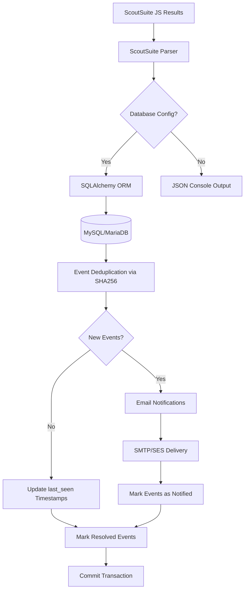
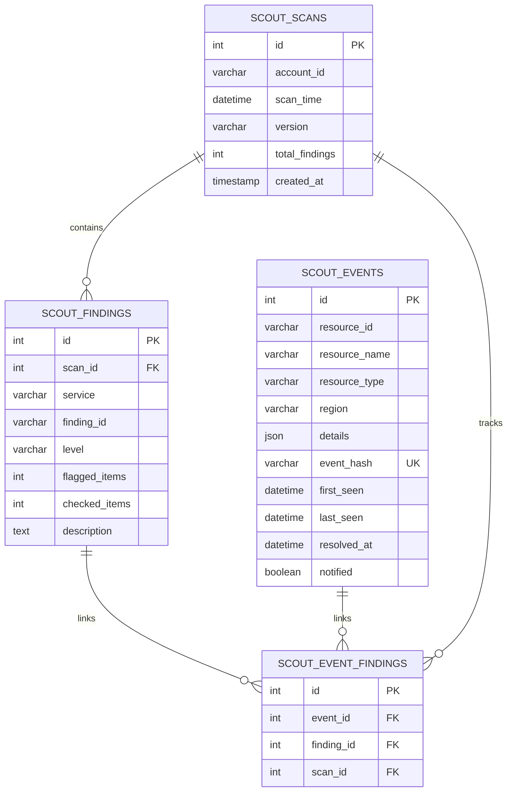
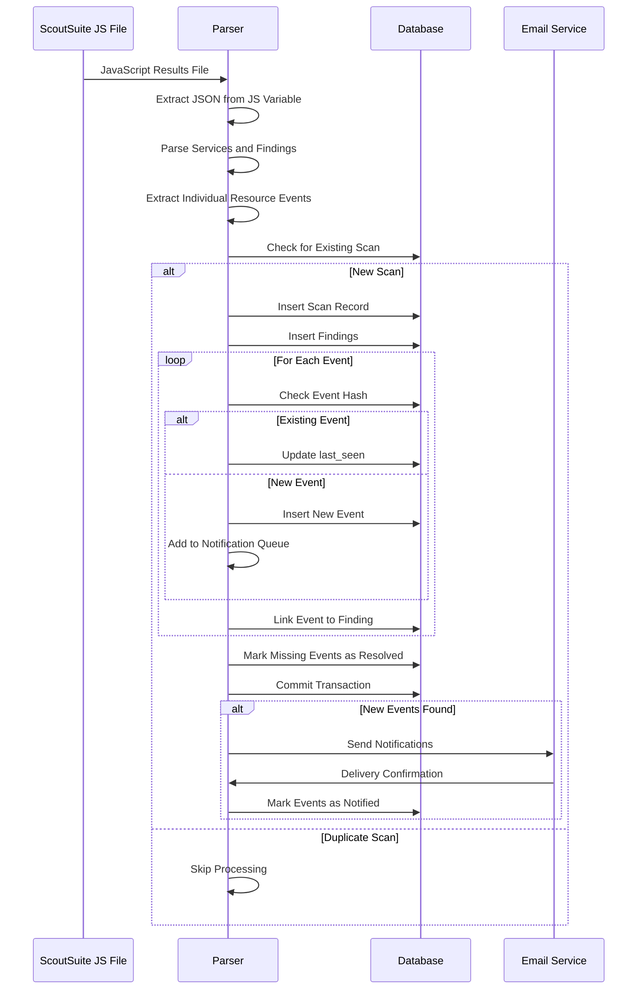
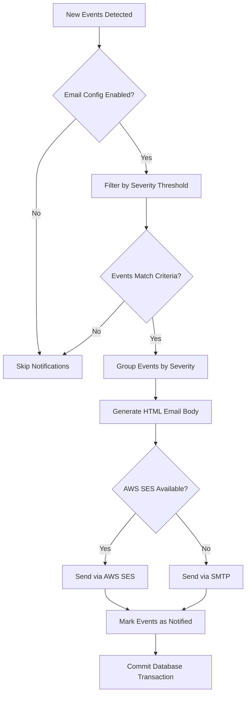

# ScoutSuite Parser

A comprehensive parser for NCC Group's open-source ScoutSuite security auditing tool, designed to extract individual resource-level security events from ScoutSuite JavaScript results files and store them in a MySQL/MariaDB database with intelligent deduplication and email notification capabilities.

## Architecture Overview



## Core Features

### ScoutSuite Integration
- **JavaScript File Parsing**: Extracts JSON data from ScoutSuite's JavaScript variable assignments (`scoutsuite_results =`)
- **Service Discovery**: Automatically processes all AWS services found in the results
- **Finding Extraction**: Converts ScoutSuite findings into structured database records
- **Resource Path Analysis**: Intelligently parses ScoutSuite's dot-notation paths to extract individual AWS resources

### Individual Resource Tracking
The parser transforms ScoutSuite's aggregated findings into individual resource events by:
- **Path Decomposition**: Breaking down paths like `services.ec2.regions.eu-west-2.vpcs.vpc-123.instances.i-456.security_groups`
- **Resource Identification**: Extracting AWS resource IDs using pattern matching (i-, sg-, vpc-, subnet-, vol-, ami-, arn:, etc.)
- **Region Extraction**: Identifying AWS regions from path structures
- **Resource Type Classification**: Determining resource types from path containers (instances → instance, security_groups → security_group)

### Event Deduplication System
- **SHA256 Hashing**: Creates unique hashes from `service:finding_id:resource_id:item_path` combinations
- **Global Deduplication**: Prevents duplicate events across multiple scans and time periods
- **Timestamp Management**: Updates `last_seen` for existing events, maintains `first_seen` for historical tracking
- **Resolution Detection**: Automatically marks events as resolved when they disappear from subsequent scans

### Email Notification System
- **Severity Filtering**: Configurable notification thresholds (critical, high, medium, low)
- **New Event Detection**: Only notifies on genuinely new security events
- **HTML Email Generation**: Rich email formatting with severity grouping and resource details
- **Dual Delivery Methods**: Support for both SMTP and AWS SES
- **Notification Tracking**: Prevents duplicate notifications via database flags

### Secure Database Connectivity
- **TLS/SSL Support**: Encrypted connections with custom certificate validation
- **Connection Pooling**: SQLAlchemy-managed connection lifecycle
- **Transaction Management**: Atomic operations with rollback capability
- **Performance Optimization**: Comprehensive indexing strategy for query performance

## Database Schema



### Table Purposes

#### scout_scans
Stores metadata about each ScoutSuite scan execution:
- **account_id**: AWS account identifier being scanned
- **scan_time**: Timestamp from ScoutSuite's execution
- **version**: ScoutSuite version used for the scan
- **total_findings**: Count of findings in this scan
- **created_at**: When this record was inserted

#### scout_findings
Represents individual ScoutSuite findings:
- **scan_id**: Links to the scan that generated this finding
- **service**: AWS service (ec2, iam, s3, etc.)
- **finding_id**: ScoutSuite's internal finding identifier
- **level**: Severity level (critical, high, medium, low, warning, danger)
- **flagged_items/checked_items**: ScoutSuite's statistics
- **description**: Human-readable finding description

#### scout_events
Individual AWS resource security events:
- **resource_id**: AWS resource identifier (i-123, sg-456, etc.)
- **resource_name**: Human-readable resource name
- **resource_type**: Type classification (instance, security_group, etc.)
- **region**: AWS region or NULL for global resources
- **details**: JSON object with additional resource metadata
- **event_hash**: SHA256 hash for deduplication
- **first_seen**: When this event was first detected
- **last_seen**: Most recent detection timestamp
- **resolved_at**: When event was marked as resolved (NULL if active)
- **notified**: Whether email notifications have been sent

#### scout_event_findings
Junction table linking events to findings across scans:
- **event_id**: Reference to the security event
- **finding_id**: Reference to the finding that detected this event
- **scan_id**: Reference to the scan where this relationship was observed

## Data Processing Flow



## Installation

### System Dependencies
```bash
# Ubuntu/Debian
sudo apt update
sudo apt install python3-pip python3-dev default-libmysqlclient-dev build-essential

# Install Python packages
pip3 install sqlalchemy pymysql python-dotenv boto3
```

### Database Setup
```bash
# Create database and user
mysql -u root -p < setup_database.sql
```

## Configuration

### Environment Variables (.env)
The parser uses environment variables for configuration, loaded via python-dotenv:

```env
# Database Configuration (Required for DB storage)
DB_HOST=localhost
DB_PORT=3306
DB_USER=scoutsuite_user
DB_PASSWORD=your_secure_password
DB_NAME=scoutsuite_db

# TLS/SSL Configuration (Optional)
DB_SSL_DISABLED=false
DB_SSL_CA=/path/to/ca-cert.pem
DB_SSL_CERT=/path/to/client-cert.pem
DB_SSL_KEY=/path/to/client-key.pem

# Email Configuration (Optional)
ENABLE_EMAIL_NOTIFICATIONS=true
SMTP_HOST=mail.yourcompany.com
SMTP_PORT=587
SMTP_USER=alerts@yourcompany.com
SMTP_PASSWORD=smtp_password
SMTP_FROM=scoutsuite-alerts@yourcompany.com
SMTP_USE_TLS=true

# AWS SES Alternative (Optional)
AWS_REGION=eu-west-1
AWS_ACCESS_KEY_ID=your_access_key
AWS_SECRET_ACCESS_KEY=your_secret_key

# Notification Settings
EMAIL_RECIPIENTS=security@yourcompany.com,devops@yourcompany.com
NOTIFY_ON_NEW_FINDINGS=true
NOTIFY_ON_SEVERITY=medium,high,critical
INITIAL_SCAN=false
```

### Configuration Loading Logic
1. **Environment Variables**: Primary configuration source via `.env` file
2. **Command Line Override**: Database settings can be overridden via CLI arguments
3. **Fallback Behavior**: Missing database config results in JSON console output
4. **Email Conditional**: Notifications only enabled if `ENABLE_EMAIL_NOTIFICATIONS=true`
5. **Initial Scan Mode**: When `INITIAL_SCAN=true`, new events are marked as notified to prevent mass emails on first scan

## Usage

### Basic Operation
```bash
# Console output (no database)
python3 scoutsuite_parser.py results.js

# Database storage with .env configuration
python3 scoutsuite_parser.py results.js

# Debug mode with detailed logging
python3 scoutsuite_parser.py results.js --debug
```

### Command Line Arguments
```bash
# Override database settings
python3 scoutsuite_parser.py results.js \
  --db-host production-db.company.com \
  --db-user prod_user \
  --db-password secure_password \
  --db-name scoutsuite_db \
  --debug
```

### Logging Levels
- **INFO**: Standard operational messages (scan progress, database operations)
- **DEBUG**: Detailed processing information (individual resource extraction, SQL queries)
- **ERROR**: Error conditions and fallback operations
- **WARNING**: Configuration issues and non-fatal problems

## Resource Extraction Logic

### Path Analysis Algorithm
The parser uses sophisticated path analysis to extract individual AWS resources:

```python
# Example path: services.ec2.regions.eu-west-2.vpcs.vpc-123.instances.i-456.security_groups
# Extraction process:
1. Split by dots: ['services', 'ec2', 'regions', 'eu-west-2', 'vpcs', 'vpc-123', 'instances', 'i-456', 'security_groups']
2. Extract region: 'eu-west-2' (follows 'regions')
3. Extract resource_id: 'i-456' (matches AWS ID pattern)
4. Extract resource_type: 'instance' (from 'instances' container, singularized)
5. Generate event_hash: SHA256('ec2:finding-id:i-456:full-path')
```

### Resource ID Pattern Matching
The parser recognizes standard AWS resource ID patterns:
- **EC2**: `i-`, `sg-`, `vpc-`, `subnet-`, `vol-`, `ami-`
- **ARN**: `arn:aws:service:region:account:resource`
- **IAM**: `user-`, `role-`, `policy-` or final path component
- **Generic**: Final path component as fallback

### Resource Type Classification
Resource types are derived from path containers with special case handling:
- `instances` → `instance`
- `security_groups` → `security_group`
- `policies` → `policy`
- `identities` → `identity`
- `repositories` → `repository`
- Generic plurals → singular form

## Database Indexes and Performance

### Index Strategy
The database schema includes comprehensive indexing for optimal query performance:

#### scout_scans
- **Primary**: `id` (auto-increment)
- **Single Column**: `account_id`, `scan_time`, `created_at`
- **Composite**: 
  - `idx_account_scan_time` (account_id, scan_time) - Duplicate scan detection
  - `idx_account_created` (account_id, created_at) - Historical queries

#### scout_findings
- **Primary**: `id` (auto-increment)
- **Foreign Key**: `scan_id`
- **Single Column**: `service`, `finding_id`, `level`
- **Composite**:
  - `idx_scan_service` (scan_id, service) - Service-specific queries
  - `idx_service_level` (service, level) - Severity filtering
  - `idx_scan_level` (scan_id, level) - Scan severity analysis

#### scout_events
- **Primary**: `id` (auto-increment)
- **Unique**: `event_hash` - Deduplication enforcement
- **Single Column**: `resource_id`, `resource_name`, `resource_type`, `region`, `first_seen`, `last_seen`, `resolved_at`, `notified`
- **Composite**:
  - `idx_resource_type_region` (resource_type, region) - Resource filtering
  - `idx_resolved_notified` (resolved_at, notified) - Active event queries
  - `idx_last_seen_resolved` (last_seen, resolved_at) - Temporal analysis
  - `idx_resource_id_type` (resource_id, resource_type) - Resource lookup

#### scout_event_findings
- **Primary**: `id` (auto-increment)
- **Foreign Keys**: `event_id`, `finding_id`, `scan_id`
- **Composite**:
  - `idx_event_finding` (event_id, finding_id) - Event-finding relationships
  - `idx_scan_event` (scan_id, event_id) - Scan-specific events
  - `idx_scan_finding` (scan_id, finding_id) - Scan-finding relationships

### Optimized Query Patterns

#### Recent High-Severity Events
```sql
SELECT se.resource_id, se.resource_name, sf.service, sf.level, se.last_seen
FROM scout_events se 
JOIN scout_event_findings sef ON se.id = sef.event_id
JOIN scout_findings sf ON sef.finding_id = sf.id 
WHERE sf.level IN ('high', 'critical')
  AND se.resolved_at IS NULL
ORDER BY se.last_seen DESC;
-- Uses: idx_resolved_notified, idx_service_level
```

#### Account-Specific Active Events
```sql
SELECT se.*, sf.service, sf.level
FROM scout_events se
JOIN scout_event_findings sef ON se.id = sef.event_id
JOIN scout_findings sf ON sef.finding_id = sf.id
JOIN scout_scans ss ON sf.scan_id = ss.id
WHERE ss.account_id = '123456789012'
  AND se.resolved_at IS NULL;
-- Uses: idx_account_scan_time, idx_resolved_notified
```

#### Resource Type Distribution
```sql
SELECT resource_type, region, COUNT(*) as count
FROM scout_events 
WHERE resolved_at IS NULL
GROUP BY resource_type, region 
ORDER BY count DESC;
-- Uses: idx_resource_type_region, idx_resolved_notified
```

#### Unnotified Events for Alerting
```sql
SELECT COUNT(*) as pending_notifications
FROM scout_events 
WHERE notified = FALSE 
  AND resolved_at IS NULL;
-- Uses: idx_resolved_notified
```

#### Event Timeline Analysis
```sql
SELECT DATE(first_seen) as date, COUNT(*) as new_events
FROM scout_events 
WHERE first_seen >= DATE_SUB(NOW(), INTERVAL 30 DAY)
GROUP BY DATE(first_seen)
ORDER BY date;
-- Uses: first_seen index
```

## Email Notification System

### Notification Logic Flow


### Email Content Structure
- **Header**: Account ID, scan timestamp, ScoutSuite version
- **Severity Sections**: Events grouped by critical, high, medium, low
- **Resource Details**: Resource ID, name, type, region for each event
- **Finding Context**: ScoutSuite finding ID, service, and description
- **HTML Formatting**: Rich formatting for improved readability

### Delivery Methods
1. **SMTP**: Traditional email server connectivity with TLS support
2. **AWS SES**: Managed email service with boto3 integration
3. **Automatic Selection**: SES preferred if AWS credentials available

## Error Handling and Fallback

### Database Connection Failures
- **Graceful Degradation**: Falls back to JSON console output
- **Error Logging**: Detailed error messages with optional stack traces
- **Configuration Validation**: Checks for required environment variables

### Parsing Failures
- **Individual Event Errors**: Logged but don't stop processing
- **Malformed JSON**: Terminates with clear error message
- **Missing ScoutSuite Data**: Handles incomplete result files

### Email Delivery Failures
- **Non-blocking**: Email failures don't affect database operations
- **Detailed Logging**: SMTP/SES error messages captured
- **Partial Success**: Successfully processes events even if notifications fail

## Security Considerations

### Database Security
- **TLS Encryption**: All connections encrypted by default
- **Certificate Validation**: Custom CA certificate support
- **Credential Isolation**: Environment-based configuration
- **SQL Injection Prevention**: SQLAlchemy ORM parameterized queries

### Email Security
- **TLS SMTP**: Encrypted email transmission
- **Credential Separation**: Isolated email service credentials
- **Content Sanitization**: HTML escaping in email templates

### Data Privacy
- **Minimal Data Storage**: Only security-relevant resource metadata
- **Hash-based Deduplication**: Cryptographic event identification
- **Configurable Retention**: Resolved events can be archived/purged

## Troubleshooting

### Common Issues

#### Database Connection Problems
```bash
# Check connectivity
mysql -h $DB_HOST -u $DB_USER -p $DB_NAME

# Verify SSL configuration
mysql -h $DB_HOST -u $DB_USER -p --ssl-ca=/path/to/ca.pem
```

#### Email Delivery Issues
```bash
# Test SMTP connectivity
telnet $SMTP_HOST $SMTP_PORT

# Verify AWS SES setup
aws ses verify-email-identity --email-address alerts@company.com
```

#### Performance Issues
```sql
-- Check index usage
EXPLAIN SELECT * FROM scout_events WHERE resource_type = 'instance';

-- Monitor table sizes
SELECT table_name, table_rows, data_length 
FROM information_schema.tables 
WHERE table_schema = 'scoutsuite_db';
```

### Debug Mode
Enable detailed logging with `--debug` flag:
- Individual resource extraction details
- SQL query execution information
- Full error stack traces
- JSON output of parsed data

### Log Analysis
```bash
# Monitor processing in real-time
python3 scoutsuite_parser.py results.js --debug | tee parser.log

# Extract timing information
grep "Processing finding" parser.log

# Check for errors
grep "ERROR" parser.log
```